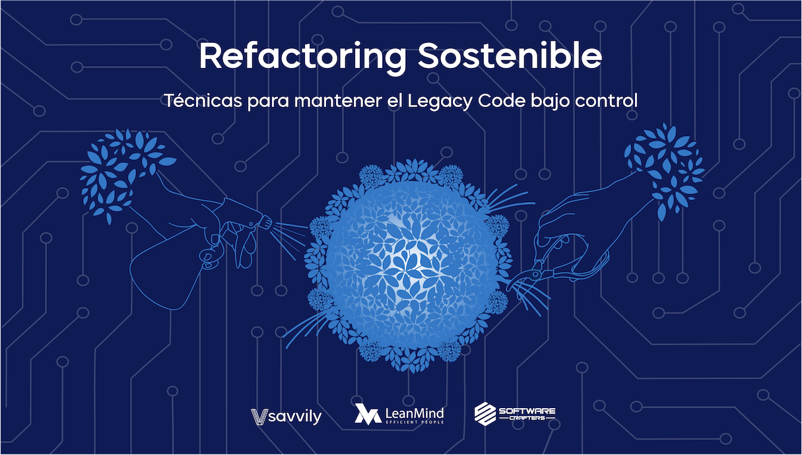

# Refactoring Legacy Frontend

## Refactoring Sostenible - Técnicas para mantener el Legacy Code bajo control
Este ejercicio forma parte del curso [Refactoring Sostenible](https://refactoringsostenible.com)



## Requisitos

- Node.js
- NVM
## Instalación
Antes de comenzar el proyecto, debes cambiar a la versión correcta de Node e instalar las dependencias necesarias. Ejecuta los siguientes comandos en tu terminal:

```
nvm use
npm install
```
### Iniciar Backend
Para iniciar el backend de la aplicación en modo desarrollo, ejecuta:
```
npm run start:back
```
### Iniciar Frontend

Para iniciar el frontend de la aplicación en modo desarrollo, ejecuta:
```
npm run start:front
```
### End-to-End (E2E) Tests

Para ejecutar las pruebas de extremo a extremo usando Cypress (recuerda iniciar el proyecto frontend y backend antes de ejecutarlo), ejecuta:

```
npm run test:e2e
```

### Unit Tests

Para ejecutar las pruebas unitarias usando Jest, ejecuta:

```
npm run test:unit
```
### Integration Tests

Para ejecutar las pruebas de integración usando Jest, ejecuta:

```
npm run test:integration
```
### Run All Tests

Para ejecutar todas las pruebas, ejecuta:
```
npm test
```
